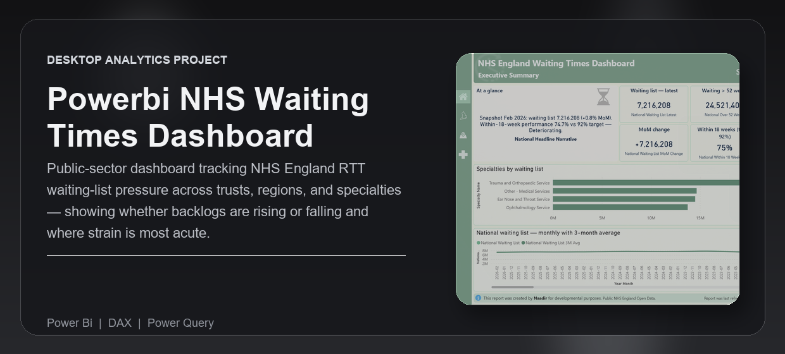
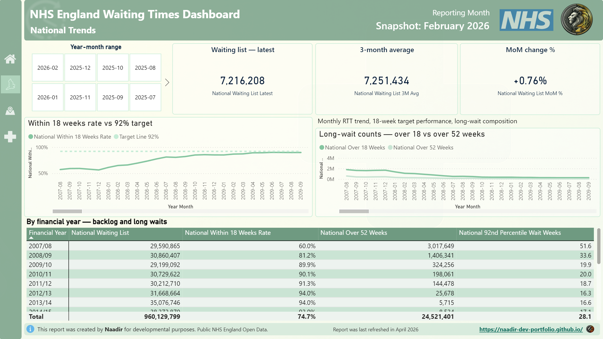
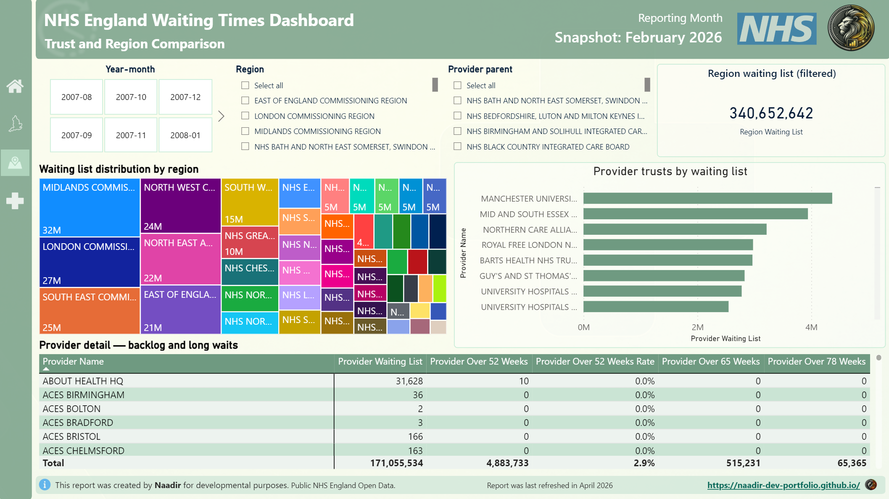
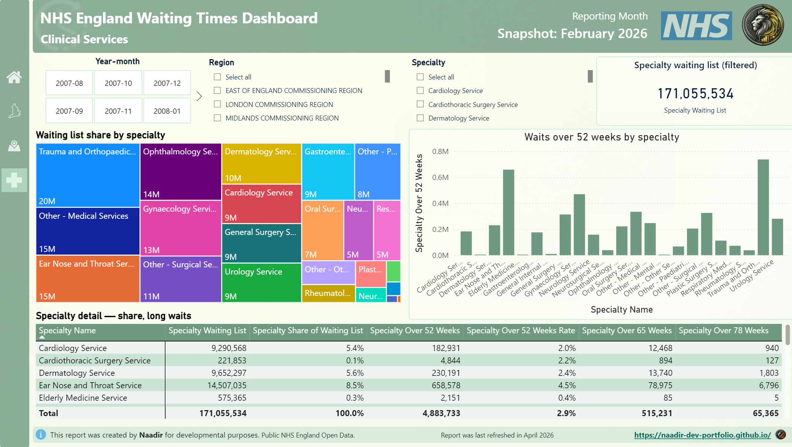

---
<div align="center">


<br /><br />

<p><strong>Public-sector dashboard tracking NHS England RTT waiting-list pressure across trusts, regions, and specialties — showing whether backlogs are rising or falling and where strain is most acute.</strong></p>

<p>Built for analysts, portfolio reviewers, and public-sector decision-makers who need a clear view of where NHS elective-care pressure is building and why it matters.</p>

<p>
  <a href="#overview">Overview</a> |
  <a href="#what-problem-it-solves">What It Solves</a> |
  <a href="#feature-highlights">Features</a> |
  <a href="#screenshots">Screenshots</a> |
  <a href="#quick-start">Quick Start</a> |
  <a href="#tech-stack">Tech Stack</a>
</p>

<h3><strong>Made by Naadir | May 2026</strong></h3>

</div>

---

## Overview

This Power BI project tracks NHS England Referral to Treatment waiting-list pressure using official open data. It brings national trends, 18-week target performance, long-wait volumes, regional pressure, provider trust rankings, and clinical service strain into one report.

The dashboard is built around four report views: an executive summary, national trends, trust and region comparison, and clinical services. It supports quick investigation from headline movement down to the trusts, regions, and specialties contributing most to the backlog.

The practical outcome is a portfolio-ready public-sector analytics report that does more than show waiting-list totals. It explains whether pressure is improving or deteriorating, where long waits are concentrated, and which services need closer attention.

## What Problem It Solves

- Removes guesswork from whether NHS RTT waiting-list pressure is rising, falling, or shifting into longer waits
- Replaces manual checking across monthly NHS workbooks with a prepared Power BI model and refreshable data pipeline
- Makes trust, region, and specialty bottlenecks visible in one report instead of separate spreadsheets
- Gives a clearer analytical view than the default raw publications by combining trend, ranking, rate, and long-wait measures

### At a glance

| Track | Analyse | Compare |
|---|---|---|
| National RTT waiting-list size, long waits, and 18-week performance | Month-on-month movement, rolling averages, target gaps, and long-wait rates | Trusts, commissioning regions, provider parents, and clinical specialties |
| Official NHS England monthly RTT data | Waiting list totals, over-18-week waits, over-52-week waits, and 92nd percentile waits | Latest snapshot against historical trend and filtered service views |
| Refreshable local data pipeline | Power BI charts, KPI cards, treemaps, slicers, and detail tables | Backlog volume versus long-wait severity across organisations and services |

## Feature Highlights

- **Executive snapshot**, combines latest waiting list, month-on-month change, over-52-week waits, 18-week performance, and a plain-English narrative
- **National trend analysis**, shows monthly RTT movement, 3-month average, long-wait composition, and performance against the 92% standard
- **Trust and region comparison**, ranks provider trusts by waiting-list pressure and compares regional distribution with filterable detail tables
- **Clinical services deep dive**, shows which specialties carry the largest backlog share and where over-52-week waits are concentrated
- **Reusable semantic model**, includes date, provider, region, and specialty dimensions with business-readable DAX measures
- **Automated source preparation**, downloads and shapes official NHS England open data into curated model-ready CSV files

### Core capabilities

| Area | What it gives you |
|---|---|
| **Executive monitoring** | A fast read on whether national waiting-list pressure is improving or deteriorating |
| **Trend analysis** | Long monthly history for waiting lists, long waits, and 18-week target performance |
| **Operational comparison** | Side-by-side ranking of trusts, regions, and provider groups by backlog and long-wait pressure |
| **Service-line analysis** | Specialty-level backlog share, long-wait counts, and severity measures |

## Screenshots

<details>
<summary><strong>Open screenshot gallery</strong></summary>

<br />

<div align="center">
  
  <br /><br />
  
  <br /><br />
  
</div>

</details>

## Quick Start

```bash
# Clone the repo
git clone https://github.com/Naadir-Dev-Portfolio/powerbi-nhs-waiting-times-dashboard.git
cd powerbi-nhs-waiting-times-dashboard

# Install dependencies
No package install required. Use Power BI Desktop to open the PBIP file.

# Run
Open "NHS Waiting Times Dashboard.pbip" in Power BI Desktop and refresh the model.
```

No API keys are required. The project uses public NHS England open data, with raw files and acquisition scripts stored in `Source Data`.

## Tech Stack

<details>
<summary><strong>Open tech stack</strong></summary>

<br />

| Category | Tools |
|---|---|
| **Primary stack** | `DAX` | `Power Query` |
| **UI / App layer** | `Power BI Desktop` | `PBIP` |
| **Data / Storage** | `CSV` | `XLSX` | `NHS England Open Data` |
| **Automation / Integration** | `Python acquisition script` | `Local data refresh workflow` |
| **Platform** | `Windows` | `Power BI Desktop` |

</details>

## Architecture & Data

<details>
<summary><strong>Open architecture and data details</strong></summary>

<br />

### Application model

The project starts with official NHS England RTT publications. A Python script downloads the source workbooks and CSV extracts, then prepares curated tables for national trends, provider trusts, provider specialties, regions, regional specialties, and supporting dimensions.

Power BI imports the curated CSV layer through Power Query, models it as a star schema, and uses DAX measures for latest snapshot values, month-on-month movement, rolling averages, long-wait rates, 18-week target performance, provider rankings, region pressure, and specialty share. The report outputs four dashboard pages focused on executive summary, national trends, trust and region comparison, and clinical services.

### Project structure

```text
powerbi-nhs-waiting-times-dashboard/
+-- NHS Waiting Times Dashboard.pbip
+-- NHS Waiting Times Dashboard.Report/
+-- NHS Waiting Times Dashboard.SemanticModel/
+-- Source Data/
+-- docs/
+-- README.md
+-- repo-card.png
+-- portfolio/
    +-- powerbi-nhs-waiting-times.json
    +-- powerbi-nhs-waiting-times-dashboard.png
    +-- Screen1.png
    +-- Screen2.png
    +-- Screen3.png
```

### Data / system notes

- The model uses official NHS England RTT open data, with no account or API key required.
- Raw source files are cached locally and curated CSV outputs are stored under `Source Data/curated`.
- The report is designed for Power BI Desktop using PBIP project files, DAX measures, and Power Query imports.

</details>

## Contact

Questions, feedback, or collaboration: `naadir.dev.mail@gmail.com`

<sub>DAX | Power Query</sub>

---
